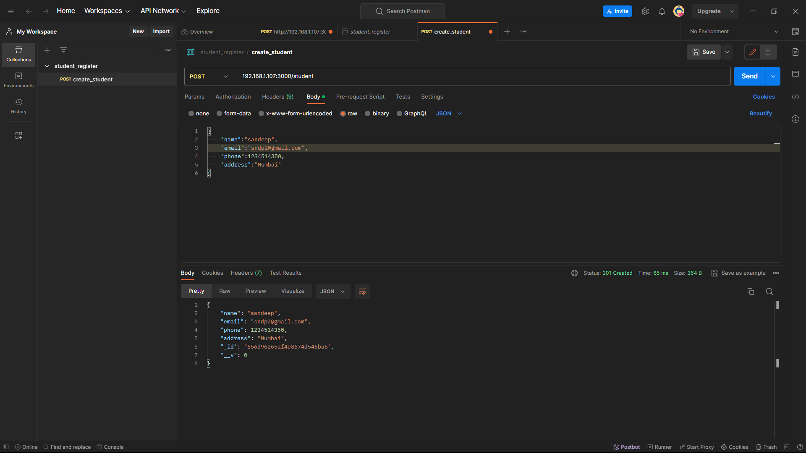
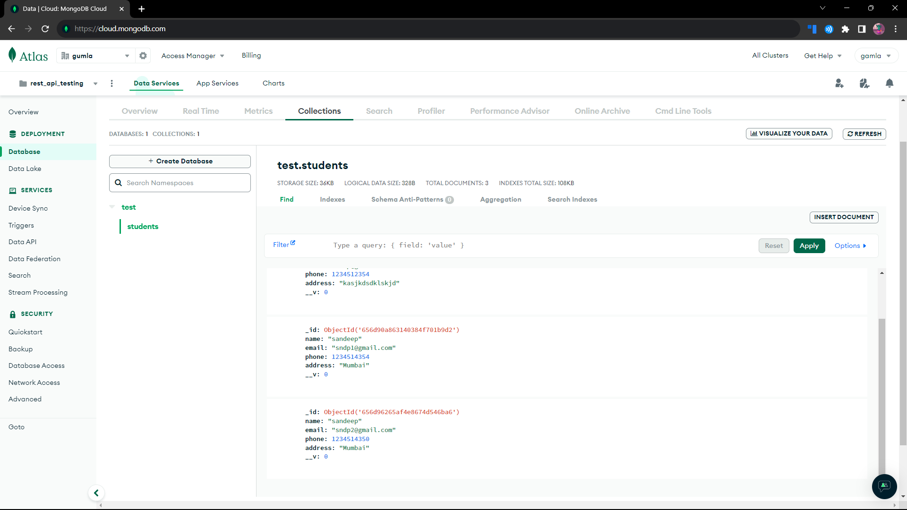

## Installation

#### Initialize the node package manager in folder using Terminal

```bash
  mkdir rest_api
  cd rest_api
  npm init or npm init -y
```
#### Now install express, mongoose, validator  using npm

```bash
  npm i express
  npm i mongoose
  npm i validator

```

##### What is express

Express Fast, unopinionated, minimalist web framework for Node.js.

[Click here to get express documentaion](https://expressjs.com/en/5x/api.html)

##### What is mongoose

Mongoose provides a straight-forward, schema-based solution to model your application data. It includes built-in type casting, validation, query building, business logic hooks and more, out of the box.

[Click here to get mongoose documentaion](https://mongoosejs.com/docs/guide.html)

##### What is validator

A library of string validators and sanitizers.

[Click here to get validator documentaion](https://www.npmjs.com/package/validator)

##### Connection to Database

```bash
const mongoose = require("mongoose");

//you have to add your own username and password 
const URL = "mongodb+srv://<your username>:<your password>@testing.s5qyb6c.mongodb.net/?retryWrites=true&w=majority";

//ConnectionParam is not necessary in new version 

//if ask then add in mongooses.connect(connectionParams,URL)
const connectionParams={
     useNewUrlParser: true,
     useCreateIndex: true,
     useUnifiedTopology: true 


}
mongoose.connect(URL)
    .then( () => {
        console.log('Connected to database ')
    })
    .catch( (err) => {
        console.error(`Error connecting to the database. \n${err}`);
    })

```

##### Data Schema for database
```bash
const mongoose = require("mongoose");
const validator = require("validator");


const studentSchema = new mongoose.Schema({
    name : {
        type :String,
        require : true,
        minlength : 3
    },
    email:{
        type:String,
        require: true,
        unique:[true,"Email already present"],
        validate(value){
            if(!validator.isEmail(value)){
                throw new Error("Invalid Error");
            }
        }
    },
    phone:{
        type:Number,
        min:10,
        
        required: true,
        unique:true
    },
    address:{
        type:String,
        required:true,

    }
});

//create a new collection using models
const student = new mongoose.model('student',studentSchema);
module.exports = student;

```

##### Inserting the data in Database

```bash
const express = require("express");

require("./DB/connection");
const student = require("./models/student");

const app = express();
const port = process.env.PORT || 3000;
app.use(express.json());


app.get("/",(req,res)=>{
    res.send("hello form backend1");
});

app.post("/student",(req,res)=>{
    console.log(req.body);
    const user = new student(req.body);
    user.save().then(()=>
    {
        res.status(201);
        res.send(user);
    }).catch((e)=>{
        res.status(400).send(e);
    })
    //res.send("hello form backend");
});

app.listen(port,()=>{
    console.log(`connection is set on ${port}`);
});

```
##### Verify the api using Postman



##### Check whether data added or not



##### Deleting from database

```bash
//delete the students form data

app.delete("/student/:id",async(req,res)=>{
    try{
        const id = req.params.id;
        const deleteStudent = await student.findByIdAndDelete(id); 

        if(!req.params.id){
            return res.statusCode(400).send;
        }else{
            res.send(deleteStudent);
        }

    }catch(e){
        res.status(500).send(e);
    }
});

```


##### Updating the data

```bash 

//Update the data


app.patch("/student/:id",async(req,res)=>{

    try{
    const _id = req.params.id;
    const updateStudent = await student.findByIdAndUpdate(_id,req.body,{
        new:true
    });

    if(!req.params.id){
        return res.statusCode(400).send;
    }else{
        res.send(updateStudent);
    }}
    catch(e){
        res.status(500).send(e);
    }


});


```
